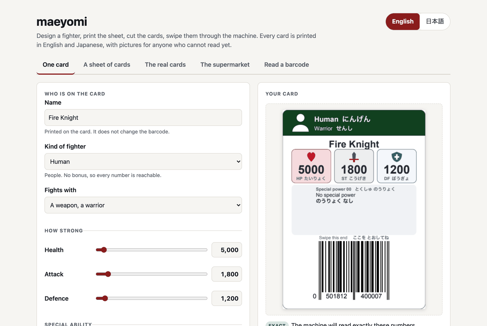
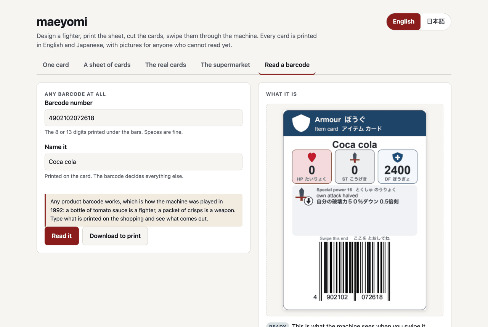
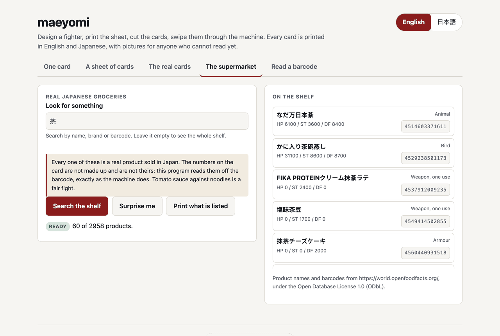

<div align="center">

# maeyomi

<strong>1992年のエポック社「バーコードバトラーII」で遊べるカードを印刷します。</strong>

[English](README.md) &nbsp;|&nbsp; 日本語

[](https://github.com/gufranco/maeyomi/actions/workflows/ci.yml)
[](LICENSE)
[](#開発)
[](pyproject.toml)

<p align="center">
  <a href="#インストール">インストール</a> &nbsp;|&nbsp;
  <a href="#起動する">起動する</a> &nbsp;|&nbsp;
  <a href="#コマンドラインから">コマンドライン</a> &nbsp;|&nbsp;
  <a href="#しくみ">しくみ</a> &nbsp;|&nbsp;
  <a href="#スーパーマーケット">スーパーマーケット</a> &nbsp;|&nbsp;
  <a href="#出典">出典</a>
</p>

</div>

公式カード **572枚** を採録。日本の食品 **2958件**。特殊能力 **100種**。カードはすべて英語と日本語の2言語。テストカバレッジ **100%**。実機で確認済み。

---

バーコードバトラーIIは、バーコードの数字だけからキャラクターやアイテムを決めます。前読み（まえよみ）は、そのうちキャラクターになる読み方の本体側の呼び名で、このプログラムの名前でもあります。maeyomi はその計算を逆向きに解きます。防御力2400の「ぼうぐ」がほしいと指定すれば、本体がそう読むバーコードを求めて印刷します。

生成したバーコードは紙に出る前に必ずもう一度デコーダに通します。印刷したページはラスタライズしてバーコードリーダーで読み直します。印刷したカードは実機のバーコードバトラーIIに通して確認しました。

## インストール

```bash
brew tap gufranco/maeyomi https://github.com/gufranco/maeyomi
brew install gufranco/maeyomi/maeyomi
```

tap はこのリポジトリそのものです。リポジトリ名が `homebrew-maeyomi` ではないため Homebrew には URL を明示します。こうしておくと formula とソースとリリースが同じ場所に揃い、別リポジトリに分かれて食い違うことがありません。

インストールすると Python 3.14 が入り、コミット済みのロックファイルから独立した環境を作ります。テストが通ったのと同じバージョンが入り、手元の Python には何も足しません。

チェックアウトから使う場合は `uv sync --extra ui` を実行し、以下のコマンドの先頭に `uv run` を付けてください。

## 起動する

```bash
maeyomi web
```

ローカルのページを立ち上げてブラウザで開きます。このプログラムができることはすべてこの画面にあるので、ここから下は読まなくても構いません。画面の説明文はこの一行です。

> せんしを つくって、いんさつして、きって、マシンに とおそう。カードは すべて えいごと にほんごで いんさつされ、もじが よめない こにも わかるように えが つきます。

<picture>
  <source media="(prefers-color-scheme: dark)" srcset="assets/screenshots/one-card-dark.png">
  
</picture>

スライダーでキャラクターを組み立てると、動かすたびにカードが描き直されます。下のパネルには、指定した数値どおりに本体が読み取るかどうかと、求まったバーコードが表示されます。

**手元にあるバーコードも、そのままカードになります。** 買い物にある数字を「バーコードを よむ」に入力すると、本体がそれをどう読むかが分かります。下の例はコカ・コーラの瓶で、本体は防御力2400の「ぼうぐ」として読みます。

<picture>
  <source media="(prefers-color-scheme: dark)" srcset="assets/screenshots/read-a-barcode-dark.png">
  
</picture>

**スーパーマーケット** には実在の日本の食品が2958件入っています。買い物に行かなくても遊べます。検索するか、**おまかせ** を押して出てきた9件をそのまま印刷してください。

<picture>
  <source media="(prefers-color-scheme: dark)" srcset="assets/screenshots/supermarket-dark.png">
  
</picture>

残り2つのタブでは、ランダムなカードを1枚のシートにまとめて印刷したり、エポック社が実際に発売した572枚を印刷したりできます。画面は英語と日本語で、上のボタンで切り替わります。

`maeyomi web --no-open` はブラウザを開かずにサーバーだけ起動します。ブラウザのない環境には `maeyomi serve` があります。

## コマンドラインから

上のタブは、すべてコマンドとしても用意されています。

ランダムなカード24枚。A4に9枚ずつ並び、シードを指定すれば何度でも同じ結果になります。

```bash
maeyomi random --count 24 --hp 1000-10000 --st 100-3000 --df 100-3000 \
    --seed 1234 --output cards.pdf
```

数値を指定して1枚だけ作る場合。

```bash
maeyomi generate --name "Fire Knight" \
    --hp 5000 --attack 1800 --defense 1200 \
    --race human --class warrior --ability 17 \
    --output fire-knight.pdf
```

指定した値と実際にできた値を並べて表示するので、違いが出たカードが黙って通ることはありません。

```
Field    Requested       Generated       Difference
---------------------------------------------------
HP       5000            5000
ST       1800            1800
DF       1200            1200
Race     human           human
Class    warrior         warrior
Ability  17              17
```

本体と同じ読み方でバーコードを読むには次のようにします。

```bash
maeyomi decode 0401207237501
```

本体は特殊能力を属性名ではなく番号で持っています。一覧はこちらです。

```bash
maeyomi abilities
```

数値のオプションは、正確な値・範囲・上下限のいずれでも指定できます。`5000`、`5000-6000`、`>=1500`、`<=3000` のように書きます。`--images png` を付けると PDF と一緒にページ画像も書き出します。

指定どおりのカードが作れない場合、`generate` はどの項目が原因かを示して何も書き出しません。`--nearest` を付けると、到達できる範囲でもっとも近いカードを作ります。

```bash
maeyomi generate --hp 20900 --st 11000 --df 10000 \
    --race mechanical --nearest --output golem.pdf
```

```
closest card differs by 100 across the requested stats
  df: requested 10000, produced 9900
```

ここでいう距離は、指定した項目に限った体力・攻撃・防御の差の合計です（表示上の単位）。種族・職業・特殊能力・素早さは近似しません。人間がほしいという指定に鳥で答えても仕方がないので、それらが原因で作れない場合は作れないまま返します。

`--back-read` を付けると、本体が後読み（うしろよみ）で読むカードになります。上限は前読みより低く、体力は99900に対して49900までです。4桁が能力値と特殊能力をまとめて決めるため、作れる組み合わせはかなり限られます。

## 動作確認

`maeyomi doctor` は、この環境で本体が読めるカードを印刷できるかどうかを確認し、各項目が何を見たかを表示します。答えの分かっているバーコードを読み、シンボルを描いて PDF から読み直し、日本語フォントが解決できているかを確かめ、配色をコントラストと色覚の基準で測り直し、2種類のカード一覧を数え、動かしている処理系・端末が日本語を表示できるか・空き容量を報告します。本当に問題があるときだけ終了コードが0以外になります。どちらの入れ方をした場合でも最初に実行してください。フォントが解決できていないと、印刷したカードの文字が空白になって初めて分かります。

## 本体が保持している値

出典は [barcodebattler.net](https://barcodebattler.net/) です。数値はデコーダに直接書き込むのではなく、計算の結果として再現しています。

| 項目 | 前読み | 後読み |
|---|---|---|
| 体力 | 0 〜 99900 | 0 〜 49900 |
| 攻撃 | 0 〜 19900 | 0 〜 11900 |
| 防御 | 0 〜 19900 | 0 〜 9900 |
| 特殊能力 | 00 〜 99 | 00 〜 29 |

種族0から4はキャラクターで、順にメカ・動物・海の生き物・鳥・人間です。種族5から9はアイテムです。職業の数字0から6は戦士、7から9は魔法使いです。値は100単位で保持されるため、能力値は必ず100の倍数になります。

指定できる範囲を狭める制約が2つあります。どちらかに当たった指定は、理由を示して断ります。黙って別の値に置き換えることはありません。

- 体力が19900を超えるキャラクターには、公開されている前読みマーカーが必要で、3桁目が9に固定されます。そのカードの体力は必ず900で終わり、素早さは必ず5になります。
- 種族0・1・2は体力20000を超えると攻撃と防御が書き換えられます。そのため、その大きさでは任意の組み合わせに到達できるわけではありません。

## しくみ

```
指定した値 -> 桁の配置 -> バーコード -> デコーダ -> 照合 -> 採用
```

前読みは決まった桁の並びを各項目に割り当てているので、逆算は探索ではなく配置です。すべて指定された要求は各桁を一意に決め、チェックディジットを計算すれば候補は1つになります。総当たりなら10^12通りを歩くところです。それでも候補は必ずデコーダに通し、どれか1項目でも食い違えば捨てます。

後読みは一対一ではありません。4桁が体力・攻撃・防御・特殊能力をまとめて決め、種族はチェックディジットの位置にあるため配置できず、空いた桁を調整して合わせにいく必要があります。到達できる集合は小さく、すべて列挙できます。10000通りの桁の組み合わせから、体力の百の位が半分になる関係で5000通りの能力値の組が生まれます。

バーコードはモジュール幅を明示してベクターで描きます。既定値は EAN の標準値である0.33mmです。ラスタライズしたバーコードをレイアウトに合わせて拡大縮小すると、モジュールの幅が不均等に丸められて読めなくなります。これは数字の文字列をいくらテストしても見つかりません。

## 印刷

必ず等倍（100%）で印刷してください。「用紙に合わせる」「縮小して全体を印刷」などの倍率指定はすべて切ってください。拡大縮小されたページは見た目には正しいまま読めなくなります。スキャナが測っているのはモジュールの幅だからです。

カードは縦向き、63.5×88.9mmのポーカーサイズで、A4に9枚並びます。カードスリーブや裁断機が想定している寸法です。これはこのプロジェクトが選んだ寸法です。エポック社は自社カードの寸法を公表しておらず、収集家のページにもオークションの出品にも wiki にも記録がありません。寸法は [`layout.py`](src/maeyomi/rendering/layout.py) の `CARD_WIDTH_MM` と `CARD_HEIGHT_MM` にあり、この2つを変えれば他もすべて追従します。グリッド・間隔・各種マーク・収まりの検査は、いずれもこの2つから導かれています。

シートは印刷所が求める条件に従います。

| 項目 | 値 | 理由 |
|---|---|---|
| 塗り足し | シートで1.5mm、`--print-shop` では3mm | 裁断が少しずれてもインクが残る |
| カード間の間隔 | 4mm（塗り足しの2倍） | 隣と共有せず、カードごとに独立した裁断線になる |
| 安全領域 | 仕上がり線から4mm | 読む必要のあるものが裁ち落とされる位置に来ない |
| トンボ | 塗り足しの端から始まる角のみの目印 | 裁断の基準になり、カードの上を線が横切らない |
| モジュール幅 | 0.330mm | GS1 EAN-13 の標準値 |
| バーの高さ | 22.85mm | GS1 の標準値であり、手で通すときの許容範囲そのもの |

`--print-shop` を付けると、同じカードをもう一つの形で書き出します。1ページに1枚、ページサイズはカードに3mmの塗り足しを加えた大きさ、定規もマークもなし。これは商業印刷所の入稿指定そのものです。

各シートの下部には100mmの定規がセンチ単位の目盛付きで入り、カードの上には各バーコードの正しい幅を英語と日本語で示す一行が入ります。最初の1枚を印刷したら定規を当ててください。短ければプリンタがページを縮小しています。設定を直してもう一度印刷してください。どちらの帯もカードの並びの外側にあるので、裁断すれば一緒に切り落とされます。

## 手元のバーコードを読む

`maeyomi decode 4901085061169` は、任意のバーコードを本体がどう読むかを表示します。`-o card.pdf --name "トマトソース"` を付ければカードも印刷します。ウェブ画面の「バーコードを よむ」も同じで、バーの下に印刷されている数字を入力すると、カードの種類・3つの数値・特殊能力・前読みと後読みのどちらで読まれるかが表示され、そのまま印刷できます。

`maeyomi kinds` は本体が扱うカードの種類を、両方の言語でそれぞれの役割とともに一覧表示します。

実際、当時はこうして遊ばれていました。商品のバーコードはどれもカードになるので、トマトソースの瓶はキャラクターに、スナック菓子の袋は武器になります。日本の商品コードも他と同じように扱えます。`4902102072618`、お茶のボトルは防御力2400の「ぼうぐ」です。

## スーパーマーケット

`maeyomi products --search 茶` は該当する日本の食品を一覧表示し、`--count 9 --seed 3` はランダムに選び、`-o shopping.pdf` で印刷します。ウェブ画面の **スーパーマーケット** も同じで、**おまかせ** ボタンが付いています。トマトソース対ラーメンも立派な勝負です。

この棚は [Open Food Facts](https://world.openfoodfacts.org/) から選んだ部分集合です。日本の企業に割り当てられたバーコード、つまり45と49で始まるものに限り、日本語表記の名前を持ち、デコーダが受け付けるものだけを残しました。元のデータは Open Database License で公開されており、この部分集合も同じ条件を引き継ぎます。[NOTICE.md](NOTICE.md) を参照してください。カード上の数値は一切そちらから来ていません。すべてこのプロジェクトのデコーダがバーコードから読み取ったものです。名前が間違っていても、冗談が一つ滑るだけで済みます。

ウェブ画面の `maeyomi decode <barcode>` は Open Food Facts に商品名も問い合わせ、分かれば名前欄に入れます。これは便宜上の機能で、問い合わせが失敗してもカードの内容は変わりません。

## 実在のカード

`maeyomi official --list` はエポック社が発売した14のカードリストと、それぞれ何枚印刷できるかを表示します。`maeyomi official --set candy -o candy.pdf` で1つを印刷し、`--set` を省略すると572枚すべてを印刷します。ウェブ画面の **ほんもののカード** も同じです。

エポック社は機械可読な一覧を公開していないため、バーコードは収集家が手元のカードを書き写した [wikiwiki.jp](https://wikiwiki.jp/barcode/) のページから取っています。各項目には出典ページの URL を記録しています。5件はチェックディジットが合いません。つまりどこかの桁が打ち間違いですが、どの桁かは特定できないため、推測で直さずに一覧に残したうえで除外しています。各カードに印刷される数値は wiki からの引き写しではなく、このプロジェクトのデコーダがバーコードから読み取ったものです。

## 隠しコマンド

`maeyomi cheat -o cheat.pdf`、またはウェブ画面の下部にある矢印の並びを押すか、画面のどこかで上・上・下・下・左・右・左・右・B・A と入力します。出てくるのは、体力99900・攻撃24500・防御19900で攻撃が2倍になるメカの魔法使いです。

この値はどこにも書き込まれていません。前読みのキャラクターを体力最大で総当たりし、デコーダ自身の計算に通して、未解決の2つのオーバーフロー分岐を避けるもののうち最強のものを残しています。24500は barcodebattler.net が公開している上限19900を超えていますが、これは攻撃の桁が二重ボーナスの集合に入るメカのキャラクターがボーナスを2回受け取るためです。

## 2つの言語と絵

カードは画面の言語に関わらず、必ず英語と日本語の両方で印刷されます。生き物の種類、戦い方、3つの能力値、特殊能力、読み取り位置の案内、そのすべてが両方の言語で入ります。どの情報にも、まだどちらの文字も読めない子ども向けの絵が付きます。種類を示す色帯と絵記号、能力値のハートと剣と盾、そして特殊能力には何がどちらに変わるかを示す絵記号が入ります。たとえば「自分の攻撃が2倍」なら上向きの矢印が付いた剣です。意味を担うのは矢印の向きで、色ではありません。

特殊能力の文言は両言語とも公開されているものです。日本語は barcodebattler.net/page05.htm からそのまま引用し、英語は同じページをこのプロジェクトが読み取ったものです。種族・職業・能力値の名称はこのプロジェクト独自の訳で、子どもが最初に習うひらがなとカタカナで書いています。プレイヤーが入力した名前は、どちらの文字でも入力どおりに印刷されます。

ウェブ画面は上部のボタンで英語と日本語を切り替え、選んだ言語を記憶します。

日本語はどの PDF リーダーにも入っているフォントで組んでいますが、埋め込みではなく参照です。印刷所に入稿する場合は PDF ではなく `--images png` で書き出したページ画像を送ってください。600dpi で、文字はすでに描画済みです。

## マウスがなくても、目が見えなくても

画面はキーボードだけで操作できます。スキップリンクで見出しを飛ばせ、5つのタブはタブ移動1回分にまとまっていて矢印キーで切り替わり、Home と End で両端に移動します。すべての操作部分にフォーカスの枠が表示され、どれも44×44ピクセル以上あり、食品の一覧はキーボードでスクロールできます。言語の切り替えは文書の `lang` も変えるので、スクリーンリーダーの読み上げも切り替わります。動きを減らす設定が有効な環境では、アニメーションを行いません。

axe-core は5つのタブすべてで、明るい配色でも暗い配色でも、WCAG 2.2 の A と AA に加えて独自のベストプラクティス規則についても違反を報告しません。規則では判定できない部分は実際のブラウザで手作業で確認しました。フォーカスの枠はスタイルシートではなくフォーカス中の要素から読み出して確認し、下部の隠しコマンドの目印は背景に対して7.43対1でした。

PDF には、構造ツリーなしで持てるものを入れてあります。各ファイルは自分の名前を持つので、読み上げソフトは `sheet.pdf` ではなく「Barcode Battler II card: Tea」と読み上げ、ファイル名よりその題名を優先するよう指定してあります。文書には言語・作成者・内容が宣言されています。カード上の文字はすべて実体のあるテキストです。名前、数値、特殊能力、両方の言語、バーの下の数字まで、すべてファイルから取り出せます。取り出される順序も人が読む順序で、まず種類、次に名前、各数値はそれが何を表すかのラベルの後、続いて特殊能力、最後にバーコードです。

入っていないものもあります。ReportLab はタグツリーを出力しないので、これらは PDF/UA ではありません。見出しもリストもなく、絵記号に代替テキストは付いておらず、日本語の部分に個別の言語指定もありません。絵記号は隣の文字が言っていることを繰り返しているだけなので、説明がなくても失われる情報はありません。検証ツールはこれらをタグなしと判定します。

## 色

カードは印刷所に出すことが多く、その場合は白黒で刷られることも珍しくありません。また渡す相手は子どもで、男の子のおよそ12人に1人は赤と緑を見分けません。どちらも測定で対処しています。

色だけで区別されるものはありません。どの色帯にも名前と絵記号があり、どの能力値にも固有の形と2文字のラベルがあるので、白黒で印刷したカードも色付きと同じことを伝えます。

計算は `src/maeyomi/rendering/colour.py` にあり、`tests/rendering/test_palette.py` が配色をその基準に照らします。

| 検査 | 基準 | 出典 |
|---|---|---|
| 色帯の上の白文字、カラーとグレースケールの両方 | 4.5対1 | WCAG 2.2 コントラスト最低基準 |
| タイル上の絵記号、カラーとグレースケールの両方 | 3対1 | WCAG 2.2 非テキストコントラスト |
| キャラクターの色帯どうし、通常の色覚と1型・2型・3型色覚 | CIE 1976 で20 | 2色が「同じ色の濃淡」ではなく「別の色」として読める距離 |
| キャラクターの色帯どうし、グレースケール印刷時 | 1.15対1 | 見分けのつく明度差 |
| 武器と防具の使い切り版と常設版、グレースケール時 | 1.5対1 | 絵記号が共通なので、明度がより多くを担う必要がある |

2色覚のシミュレーションは Brettel・Viénot・Mollon の線形近似を使っています。シートはラスタライズしてグレースケールに変換し、その上のすべてのバーコードをデコードしているので、色を一切出せないプリンタでも通用します。

## 出典

デコーダは MIT ライセンスの [Barcode Battler II Simulator](https://github.com/finalfighter/BarcodeBattler2-Simulator) の `src/BarcodeRead.as` を移植したものです。能力値の範囲、読み取り方式の判定規則、特殊能力の表は [barcodebattler.net](https://barcodebattler.net/) に拠ります。カードのテストデータは [wikiwiki.jp](https://wikiwiki.jp/barcode/) のカードリストから取得し、各項目に出典ページと取得日を記録しています。全体の帰属とライセンスの境界は [`NOTICE.md`](NOTICE.md) にあります。

未解決の挙動が3つあり、`src/maeyomi/decoder/uncertainties.py` に記録しています。デコーダは3つとも忠実に再現しますが、ジェネレータはそのうち2つ、確認できていない値を印刷したカードに載せてしまうものについては出力を拒否します。

## 開発

```bash
uv run ruff format .
uv run ruff check .
uv run pyright
uv run pytest --cov
```

テストデータは `uv run python tools/fetch_fixtures.py` で作り直します。
