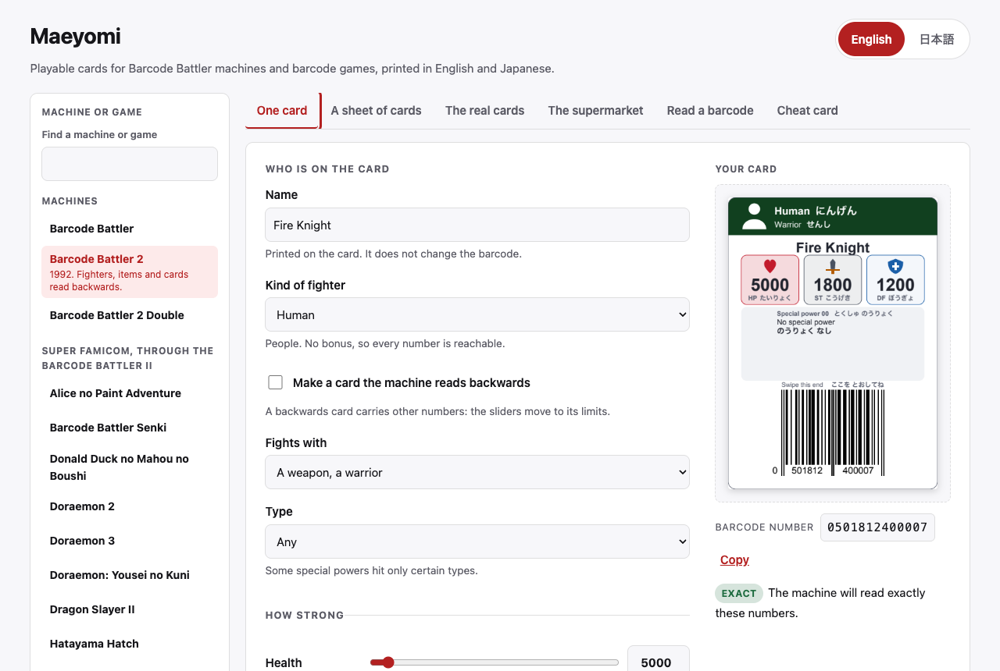
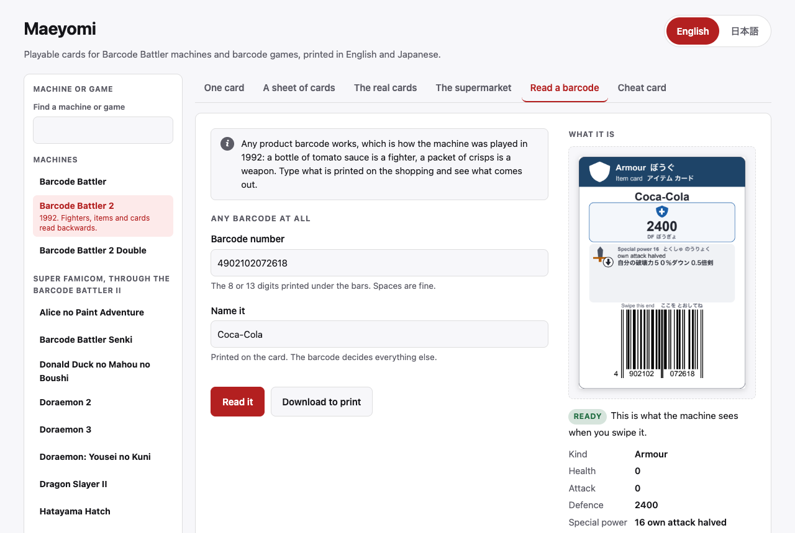
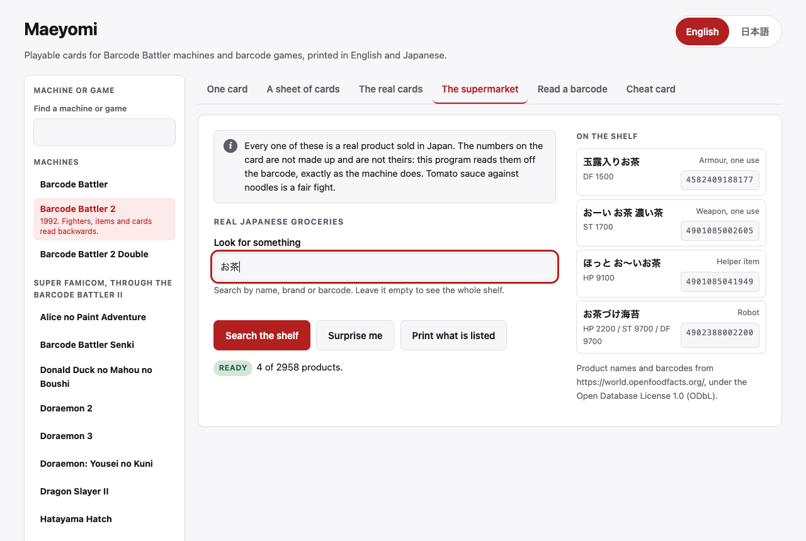

<div align="center">

# maeyomi

<strong>Print playable cards for Barcode Battler machines and barcode games.</strong>

English &nbsp;|&nbsp; [日本語](README.ja.md)

[](https://github.com/gufranco/maeyomi/actions/workflows/ci.yml)
[](LICENSE)
[](https://github.com/gufranco/maeyomi/actions/workflows/ci.yml)
[](pyproject.toml)

<p align="center">
  <a href="#what-it-supports">What it supports</a> &nbsp;|&nbsp;
  <a href="#install">Install</a> &nbsp;|&nbsp;
  <a href="#open-it">Open it</a> &nbsp;|&nbsp;
  <a href="#from-the-command-line">Command line</a> &nbsp;|&nbsp;
  <a href="#the-machines-and-games">Machines and games</a> &nbsp;|&nbsp;
  <a href="#the-real-cards">The real cards</a> &nbsp;|&nbsp;
  <a href="#where-this-came-from">Sources</a>
</p>

</div>

**1586** official cards transcribed. **2958** Japanese groceries. **100** special powers. Two languages on every card. **100%** test coverage. Barcode Battler II cards verified on the real machine.

---

Barcode Battler machines, and a family of Famicom, Super Famicom and Game Boy
games, read a barcode and derive a fighter, an item or an effect from the
digits alone. This program inverts that arithmetic: ask for a 2400 defence
armour card and it works out which barcode the device would read that way,
then prints it. Maeyomi is the Barcode Battler's own word for the front read,
the one that produces a fighter.

It covers three standalone machines and 24 games: six Datach games for the
Famicom, whose reader sits in the cartridge; thirteen Famicom and Super
Famicom games that take their codes from a Barcode Battler II plugged into the
console; and five Game Boy games read through Namco's Barcode Boy. For each
one it prints the released cards whose barcodes are known, a card made to
order, and a cheat card: the strongest or most useful card the device will
read.

Every game's rule was read from the game's own program and checked against the
game running in MAME. Every barcode is decoded again before it reaches paper,
and every printed page is rasterised and read back with a barcode reader.
Printed cards were swiped on a physical Barcode Battler II.

## What it supports

Every machine and game below is a `--device` on the command line and an
entry under **Machine or game** on the web page. Photos of the machines, the
games and their card packs are on
[barcodebattler.co.uk](https://www.barcodebattler.co.uk/scans/Japan/).

| Machine or game | Japanese title | Runs on | `--device` |
|---|---|---|---|
| Barcode Battler | バーコードバトラー | Standalone machine | `bb1` |
| Barcode Battler 2 | バーコードバトラー2 | Standalone machine | `bb2` |
| Barcode Battler 2 Double | バーコードバトラー2 ダブル | Standalone machine | `double` |
| Alice no Paint Adventure | アリスのペイントアドベンチャー | Super Famicom, through the Barcode Battler II | `alice` |
| Barcode Battler Senki | バーコードバトラー戦記 | Super Famicom, through the Barcode Battler II | `senki` |
| Donald Duck no Mahou no Boushi | ドナルドダックの魔法のぼうし | Super Famicom, through the Barcode Battler II | `donald` |
| Doraemon 2 | ドラえもん2 のび太のトイズランド大冒険 | Super Famicom, through the Barcode Battler II | `doraemon2` |
| Doraemon 3 | ドラえもん3 のび太と時の宝玉 | Super Famicom, through the Barcode Battler II | `doraemon3` |
| Doraemon: Yousei no Kuni | ドラえもん のび太と妖精の国 | Super Famicom, through the Barcode Battler II | `yousei` |
| Dragon Slayer II | ドラゴンスレイヤー英雄伝説II | Super Famicom, through the Barcode Battler II | `dslayer2` |
| Hatayama Hatch | はた山ハッチのパロ野球ニュース!実名版 | Super Famicom, through the Barcode Battler II | `hatayama` |
| J.League Excite Stage '94 | J.リーグエキサイトステージ'94 | Super Famicom, through the Barcode Battler II | `excite94` |
| J.League Excite Stage '95 | J.リーグエキサイトステージ'95 | Super Famicom, through the Barcode Battler II | `excite95` |
| Lupin III | ルパン三世 伝説の秘宝を追え! | Super Famicom, through the Barcode Battler II | `lupin` |
| Spider-Man: Lethal Foes | スパイダーマン リーサルフォーズ | Super Famicom, through the Barcode Battler II | `spiderman` |
| Datach Battle Rush | データック バトルラッシュ | Famicom Datach | `battlerush` |
| Datach Dragon Ball Z | データック ドラゴンボールZ | Famicom Datach | `dbz` |
| Datach J.League | データック Jリーグ スーパートッププレイヤーズ | Famicom Datach | `jleague` |
| Datach SD Gundam Wars | データック SDガンダム ガンダムウォーズ | Famicom Datach | `sdgundam` |
| Datach Ultraman Club | データック ウルトラマン倶楽部 | Famicom Datach | `ultraman` |
| Datach Yu Yu Hakusho | データック 幽遊白書 | Famicom Datach | `yuyu` |
| Barcode World | バーコードワールド | Famicom, through the Barcode Battler II | `barcodeworld` |
| Battle Space | バトルスペース | Game Boy, through the Barcode Boy | `bspace` |
| Monster Maker: Barcode Saga | モンスターメーカー バーコードサーガ | Game Boy, through the Barcode Boy | `monstmkb` |
| Kattobi Road | カットビロード | Game Boy, through the Barcode Boy | `kattobi` |
| Famista 3 | ファミスタ3 | Game Boy, through the Barcode Boy | `famista3` |
| Family Jockey 2 | ファミリージョッキー2 名馬の血統 | Game Boy, through the Barcode Boy | `famjock2` |

## Install

```bash
brew tap gufranco/maeyomi https://github.com/gufranco/maeyomi
brew install gufranco/maeyomi/maeyomi
```

The tap is this repository. Homebrew wants the explicit URL because the repo is
not called `homebrew-maeyomi`, which keeps the formula, the source and the
release beside each other instead of in a second repo that drifts.

Installing pulls in Python 3.14 and builds an isolated environment from the
committed lockfile, so you get the versions the tests ran against and nothing
lands in your own Python.

From a checkout instead, `uv sync --extra ui` and put `uv run` in front of
every command below.

## Open it

```bash
maeyomi web
```

That starts a local page and opens your browser at it. Everything the program
does is in there, so nothing below this point is required reading. The page
says what it is for in a line:

> Playable cards for Barcode Battler machines and barcode games, printed in English and Japanese.

<picture>
  <source media="(prefers-color-scheme: dark)" srcset="assets/screenshots/one-card-dark.png">
  
</picture>

Design a fighter with the sliders, watch the card redraw as you move them, and
print it. The panel underneath says whether the machine will read back exactly
the numbers you asked for, and shows the barcode it worked out.

**Machine or game**, first on the page, picks what the cards are for, from the
27 in the table under [What it supports](#what-it-supports). Every tab follows it: the card maker shows only the fields that device reads
and stops its sliders at the device's limits, the random sheet and the
supermarket read each barcode the way that device does, **The real cards**
lists only that device's sets and hides the set picker when there is one, and
**Cheat card** shows that device's strongest card. The same barcode is a
different card on each device. Choosing another one clears every tab and
returns to the card maker, whose card redraws as the numbers change. The
choice is kept in the address, as in `?device=dbz`, so a link or a reload
opens the same one and the back button returns to the previous one; `/`
jumps to the filter over the list, and Enter picks its first match. On the
command line, `--device` does the same for `generate`, `decode`, `cheat`,
`random`, `products`, `kinds`, `abilities` and `official`.

**Any barcode you already own is also a card.** Type the digits from the
shopping into **Read a barcode** and the page shows what the device makes of
it. This one is a bottle of Coca-Cola, which the machine reads as armour worth
2400 defence.

<picture>
  <source media="(prefers-color-scheme: dark)" srcset="assets/screenshots/read-a-barcode-dark.png">
  
</picture>

**The supermarket** holds 2958 real Japanese groceries, so a game can be played
without a shopping trip. Search it, or press **Surprise me** and print the nine
you get.

<picture>
  <source media="(prefers-color-scheme: dark)" srcset="assets/screenshots/supermarket-dark.png">
  
</picture>

The other three tabs print a sheet of random cards, the 1586 cards Epoch,
Bandai and Namco actually released, and the strongest card the chosen machine or game
will read. The page is in English and Japanese, and switches with the
buttons at the top.

`maeyomi web --no-open` starts the server without a browser, and `maeyomi
serve` is the same thing for a machine that has none.

## From the command line

Every tab above is also a command, and each takes `--device` with any name
from the table under [What it supports](#what-it-supports). Without it, a
command makes cards for the Barcode Battler II, which is what the examples
below do.

A sheet of 24 random cards, nine to an A4 page, reproducible from a seed:

```bash
maeyomi random --count 24 --hp 1000-10000 --st 100-3000 --df 100-3000 \
    --seed 1234 --output cards.pdf
```

One card built to an exact specification:

```bash
maeyomi generate --name "Fire Knight" \
    --hp 5000 --attack 1800 --defense 1200 \
    --race human --class warrior --ability 17 \
    --output fire-knight.pdf
```

It prints what you asked for beside what came out, so a card that differs cannot
pass unnoticed:

```
Field    Requested       Generated       Difference
---------------------------------------------------
HP       5000            5000
ST       1800            1800
DF       1200            1200
PP       any             5
MP       any             0
Race     human           human
Job      -               0
Class    warrior         warrior
Speed    -               0
Ability  17              17
```

Read a barcode the way the device reads it:

```bash
maeyomi decode 0401207237501
```

The device carries numeric ability codes rather than named elements. List them:

```bash
maeyomi abilities
```

Items are built the same way. A weapon carries only attack, armour only
defence, and a helper item one thing: health, herbs or magic points. Herbs and
magic points are plain counts from 0 to 99:

```bash
maeyomi generate --name "Herb Pouch" --race support_item --herbs 99 \
    --output herbs.pdf
```

Every stat option takes an exact value, a range, or a bound: `5000`,
`5000-6000`, `>=1500`, `<=3000`. Add `--images png` to export page images
beside the PDF.

When a request cannot be met exactly, `generate` says which field blocks it and
writes nothing. Add `--nearest` to get the closest reachable card instead:

```bash
maeyomi generate --hp 20900 --st 11000 --df 10000 \
    --race mechanical --nearest --output golem.pdf
```

```
closest card differs by 100 across the requested stats
  df: requested 10000, produced 9900
```

The distance is the sum of the gaps on HP, ST and DF in displayed units,
counting only the stats the request constrained. Race, class, job, ability and
speed are never approximated: a request for a human is not better served by a
bird, so a request blocked on one of those comes back unsatisfied.

Add `--back-read` for a card the device reads from the back rather than the
front. Those carry lower ceilings, 49900 HP against 99900, and four digits feed
the stats and the ability jointly, so far fewer combinations are reachable.

## The machines and games

### Barcode Battler II

The Barcode Battler II is the default device. It reads a barcode and derives a
fighter or an item from the digits alone, from the front or, for a card swiped
the other way, from the back.

#### What the device actually stores

From [barcodebattler.net](https://barcodebattler.net/), reproduced by the
decoder rather than coded into it.

| Attribute | Front read | Back read |
|---|---|---|
| HP | 0 to 99900 | 0 to 49900 |
| ST | 0 to 19900 | 0 to 11900 |
| DF | 0 to 19900 | 0 to 9900 |
| Special ability | 00 to 99 | 00 to 29 |

Races 0 to 4 are characters: mechanical, animal, aquatic, bird, human. Races 5
to 9 are items. Job digits 0 to 6 are warriors, 7 to 9 are magicians. Values are
stored in units of 100, so every stat is a multiple of 100.

Two constraints narrow what can be asked for. A request that hits either one is
refused with the reason, never quietly altered:

- A character above 19900 HP needs the published front-read marker, which forces
  the third digit to 9. Such a card's HP always ends in 900, and its speed is
  always 5.
- Races 0, 1 and 2 have their strength and defence rewritten above 20000 HP, so
  not every pair of values is reachable at that size. Some of those codes make
  the device fight with more attack or defence than it displays, up to 24600;
  the card prints that value too.

#### How it works

```
requested attributes -> digit placement -> barcode -> decoder -> compare -> accept
```

The front reading maps fixed digit slices onto attributes, so inverting it is
placement rather than search: a fully specified request determines every digit
and the check digit is computed, leaving one candidate rather than the 10^12 a
brute force would walk. Every candidate still goes back through the decoder, and
one that disagrees on any field is discarded.

The back reading is not a bijection. Four digits feed hit points, strength,
defence and the ability jointly, and the race sits on the check digit position,
so it cannot be placed and has to be arrived at by tuning a free digit. The
reachable set is small enough to enumerate outright: 10000 digit combinations
produce 5000 distinct stat triples, because the hit point hundreds digit is
halved.

Barcodes are drawn as vectors at an explicit module width, defaulting to the EAN
nominal 0.33 mm. A rasterised barcode scaled to fit a layout rounds its modules
unevenly and stops scanning, which no test on the digit string would catch.

### The first Barcode Battler

The first Barcode Battler, from 1991, reads the same digits its own way: every
fighter is a warrior, health stops at 19900, attack and defence at 9900, and the
two-digit code is a flag from a different table, so 18 is the hero where the II
doubles the attack. Add `--device bb1` to `decode`, `generate` and `cheat` to
make cards for it. Its decoder reproduces 113 published cards from the four
lists written for it, and no card for it has been read on a physical first
Barcode Battler yet, which every sheet for it says.

### Barcode Battler II Double

The Barcode Battler II Double, the II² of 1993, has no reader and takes codes
from a II. It reads them the II's way, except a code that starts with 7 and has
8 as its tenth digit, which it reads its own way: attack and defence reach
99900, and the special power is two of the health's digits.
`--device double` makes cards for it, using "BBIIダブルC0" on
[barcodebattler.net](https://barcodebattler.net/bb2c0.html) as its source. That
reading explains the eleven cards of the 正伝3 list that no II reading could.
Its race is the attack's hundreds digit less 5, as a
[collector's report](https://mevius.5ch.net/test/read.cgi/toy/1226667612/)
found on the 正伝3 and 正伝4 enemy cards; all eleven fit, and with a hundreds
digit below 5 the race is unknown. Its speed is still unknown.
The Double also names two classes the II does not, the priest for job 4 and the
holy warrior for job 6, and has its own table of special powers.

### Datach games

The Datach is Bandai's barcode reader for the Famicom, a cartridge with a slot
for the game's own smaller cartridge.

Bandai's Datach Dragon Ball Z: Gekitou Tenkaichi Budoukai, a Famicom game of
1992, came with a barcode reader. `--device dbz` makes cards for it. The game
scatters the bits of ten digits into a 40-bit number and reads a fighter or an
item, a special move level, HP, BP and DP from it. That rule was read out of
the game's own program, and the decoder agrees with the game running in MAME on
every one of the 232 codes the game accepted there. Pick the fighter or item
with `--character`, by the name the game shows or by its id, the level with
`--level`, and the numbers with `--hp`, `--bp` and `--dp`, adding `--nearest`
to take the closest printable card when those exact numbers cannot print; a fighter whose
numbers are high enough turns into its stronger form, as the game does. No card
for it has been read by a physical Datach yet, which every sheet for it says.

Datach Ultraman Club: Supokon Fight!, Bandai's second Datach game, of 1993,
reads a barcode into one of 51 types, Ultra heroes and monsters from 0 to 27
and items from 32 up, and three numbers it calls PW, ST and SP, each 0 to 9900
in steps of 100. `--device ultraman` makes cards for it: pick the type with
`--character`, by the name the game shows or by its number, and the three
numbers with `--hp`, `--st` and `--df` in that order. Every value in that range
prints. The rule was read out of the game's program and agrees with the game
itself, running in MAME, on its 38 released cards and on 51 codes built one per
type. No card for it has been read by a physical Datach yet.

Datach SD Gundam: Gundam Wars, also of 1993, reads a barcode as one of 63 mobile
suits or one of 59 command cards. A mobile suit starts from its own HP, AP, DP
and CP, adds a bonus from a table to each, and carries one of two short-range
and one of two long-range weapons; a command card carries its effect and the
CP it costs. `--device sdgundam` makes cards for it: pick the card with
`--character`, by name, model number or number, the numbers with `--hp`,
`--st` and `--df`, which are HP, AP and DP, and the weapons and CP with
`--pick sr=1`, `--pick lr=5` or `--pick cp=11`. A number between two the game
can hold becomes the closest one, and the command says so. The rule agrees
with the game in MAME on its 76 released barcodes and on 122 codes built one
per slot. No card for it has been read by a physical Datach yet.

Datach Yu Yu Hakusho: Bakutou Ankoku Bujutsukai, also of 1993, reads a barcode
as one of 22 fighters or 10 items, and one more fighter the game hides. A
fighter's HP and SP are its own and no barcode changes them; what the barcode
chooses is which of its four techniques it can use. An item adds HP or SP by
one of four levels, or changes a rule of versus mode. `--device yuyu` makes
cards for it: pick the card with `--character`, its techniques with `--pick
moves=15`, one bit per technique, and an item's level with `--pick level=3`.
The rule agrees with the game in MAME on its 37 released cards and on 183
codes built across every character, mask and item. No card for it has been
read by a physical Datach yet.

Datach J.League Super Top Players, of 1994, reads a barcode as one of the 150
players of the 1993 J.League's ten clubs, or as one of those clubs. A card
names a real player and carries no numbers of its own. The game's program
keeps a profile, a face and an appearance for each player and no ability, so
no card is stronger than another and there is no cheat card for it. `--device jleague` makes
cards for it: pick the player or club with `--character`, by name or number.
The rule agrees with the game in MAME on its 160 released barcodes and on 12
codes built to reach every folded value the game allows. No card for it has
been read by a physical Datach yet.

Crayon Shin-chan: Ora to Poi Poi, a Datach game, has no barcode reading in its
program at all, so it cannot take a card.

Datach Battle Rush: Build Up Robot Tournament builds a robot at its Robo
Factory from two cards scanned in order, and `--device battlerush` makes the
pair. The first card carries the robot's number, head, body, shoulder, foot and
pilot; the second its weapons and four levels. The game refuses a shop's
barcode on purpose: the last digit of its own cards is one or two below the
check digit an EAN would have, so these cards are printed with that digit and
no ordinary barcode reader takes them. Pick the robot by number or by the name
of one of the 16 opponents with `--character`, and its parts and levels with
`--pick head=3 --pick attack=7` and so on. The rule was read from the game's
program and agrees with it in MAME on every pair tried; MAME only partly
emulates the game's save chip, so the checks write two of its bytes to reach
the factory. No list of the cards Bandai printed is known.

### Games read through a Barcode Battler II

These Famicom and Super Famicom games have no reader of their own. A Barcode
Battler II plugged into the console reads the card and sends the digits on.

Sunsoft's Barcode World, a Famicom game of 1992, takes its cards through a
Barcode Battler II connected to the Famicom, so it reads every barcode.
`--device barcodeworld` makes cards for it. The game reads the digits much as
the Barcode Battler II does, in hundreds: HP up to 49900, ST and DF up to 19900,
where anything above 19900 health needs a 9 in the hundreds and speed 5, and
magic and herbs come from the job. Pick a warrior or a magician with
`--character`, the numbers with `--hp`, `--st` and `--df`, and the job, speed
and ability with `--pick job=3`, `--pick speed=8` and `--pick ability=45`. The
rule agrees with the game in MAME on 211 codes, its 24 released cards among
them, and on every card built here that was tried.

Epoch's Barcode Battler Senki, a Super Famicom game of 1993, takes its cards
through a Barcode Battler II on the Barcode Battler II Interface, and
`--device senki` makes cards for it. It reads the digits the way Barcode World
does, with three differences. An 8-digit code arrives with five zeros in
front, because the interface turns the Barcode Battler II's spaces into zeros.
An item read from the end keeps the units of its strength below ten. And the
code printed on the Interface's own box opens the sound test in either battle
mode instead of making a card. The rule agrees with the game in MAME on 253
codes, every card built here that was tried among them. The Black Store, one
hidden shop of the scenario mode, reads a card read from the end with smaller
offsets, so such a card also shows the HP, ST and DF the shop gives it; that
reading agrees with the game in MAME on 232 codes, reached by setting the flag
the shop's map event sets rather than by walking to it. MAME 0.289 sends each digit to the Super Famicom one bit out of
place, so the checks feed the game through an interface written for them.

Four more Epoch games for the Super Famicom read a code on their password
screen through the same interface, and each code sets off one effect from a
fixed list rather than making a fighter: Lupin III: Densetsu no Hihou o Oe!
with `--device lupin`, Donald Duck no Mahou no Boushi with `--device donald`,
Spider-Man: Lethal Foes with `--device spiderman` and Alice no Paint Adventure
with `--device alice`. The effects are cheats such as no damage, endless lives
or full items, jumps to a stage, a chapter or an ending, and sound tests.
`maeyomi kinds --device lupin` lists a game's effects, and `--character` picks
one by name or number. Each rule was read from the game's program and agrees
with the game in MAME on every code tried: 250 for Lupin III, 247 for Donald
Duck, 221 for Spider-Man and 253 for Alice. A code that matches no rule is read
and does nothing.

Three Doraemon games for the Super Famicom read codes the same way on two
screens each: Doraemon 2 with `--device doraemon2` on its password screen and
in a stage's item menu, Doraemon 3 with `--device doraemon3` on its password
screen and in its equipment menu during play, and Nobita to Yousei no Kuni with
`--device yousei` on its password screen and on the town map's item screen. The
password screens give cheats such as invincibility, 99 lives or a later world,
and the menus give secret tools, weapons, protectors and items. Every card
names the screen to scan it on. Doraemon 4 carries the same reading code but
never calls it, so no screen in it takes a barcode.

J.League Excite Stage '94 reads a code on the Barcode Battler panel of its
roster screen before a pre-season match, and `--device excite94` makes cards
for it. A code whose check digit is 4 or more is one of 240 hidden players,
each with a name and grades for kicking, shooting, running and dribbling or,
for a keeper, defending; a lower check digit is an item card like those of
Excite Stage '95. Pick a player or an item with `--character` and an item's
amount with `--pick value=253`. The names and grades come straight from the
game's own tables, and every player but one, whom no code's digits can reach,
can be printed. PK mode reads a player the same way and an item card its own
way, as one of six PK items, kick speed, control, curve shots, saving,
quickness or instant saves, at a level from 0 to 9, which the card also shows.
Both rules agree with the game in MAME on every code tried, 168 of them in PK
mode.

J.League Excite Stage '95 for the Super Famicom reads a code on its Barcode
Battler II input screen before an open match, a league, a tournament or a
dream match, and `--device excite95` makes cards for it. Each code is an item
card: overall power, dribble, pass speed, kick speed or a keeper's saving,
raised by 0 to 253, or a special card for up to 4 handicap points or for fouls
that show no card. Pick the item with `--character` and the amount with
`--pick value=253`. PK mode reads the same code as one of four PK items, ball
speed, shot accuracy, keeper speed or keeper level, raised by one, and the card
shows which. Both readings agree with the game in MAME on every code tried, 70
of them in PK mode.

Falcom's Dragon Slayer: Eiyuu Densetsu II, which Epoch released for the Super
Famicom in 1993, reads a code on its title menu and in its field menu, and
`--device dslayer2` makes cards for it. The title menu gives cheats such as
every status at its highest, doubled experience and gold, the monster list or
the sound mode. In the field, codes that start 038438816 give the item their
last three digits number, 999 opens every warp, and a few codes use a lamp, a
Bisna nut, a rest mushroom or the map without owning it. Of the Dragon Slayer
cards Epoch printed for the Barcode Battler II, the game knows Selios: scanned
on the title menu, it sets every status of the hero to its highest.

Hatayama Hatch no Paro Yakyuu News! Jitsumei Ban, Epoch's baseball game of
1993, reads a code as a battler on its Battle Baseball Board, and
`--device hatayama` makes cards for it. A code laid out the way Epoch's cards
are is read in place: stamina up to 99900, attack and defense up to 19900 in
hundreds, and a wizard's magic up to 99; any other code is worked from its last
digits. Pick a warrior or a wizard with `--character`, the numbers with
`--hp`, `--st` and `--df`, and the magic with `--pick mp=99`. The same code's
last digit also picks a strategy and a graphic on the game's other two
barcode screens, and each card prints which. The game came with cards for 14
teams, and nobody has published their barcodes.

### Game Boy games read through the Barcode Boy

The Barcode Boy is Namco's reader for the Game Boy, which sends the digits over
the link port.

Battle Space, which Namco packed with its Barcode Boy reader for the Game Boy
in 1992, reads a code as a fighter, and `--device bspace` makes cards for it.
The game builds thirteen new digits from the barcode and reads them as HP, MP,
AP and DP, which its status screen shows times a hundred. Where those four sit
against the game's thresholds picks one of 98 classes, and the class fixes the
magic, one of three spell groups or none, and the special move. Pick a class
with `--character`, and HP, AP and DP with `--hp`, `--st` and `--df`; the
program chooses the highest MP that keeps the class and prints it on the card.
MAME has no Barcode Boy, so a script answers the Game Boy's link port the way
the reader does, and the decoder agrees with the game on all 668 codes it was
given, among them one card built for each class.

Monster Maker: Barcode Saga, Namco's 1993 Barcode Boy game, reads a card two
ways, and `--device monstmkb` makes cards for it. Forming the party, a card
gives one of 17 heroes at level 1. Later in the game the same card gives one of
35 characters: a hero at a level from 1 to 9, or one of 18 others, monsters
among them. A code
starting with 9 names its hero by digits three to five, any other code by
digits six and eight, and digits one, three and five set the later level. Pick
the hero with `--character` and what the card gives later with `--pick later=`,
the character's number times a hundred plus its level: `--pick later=1709`
brings Lorian back at level 9, and `--pick later=2000` on Link gives the
Dragon. In MAME each code is read at the party screen twice, once as a new game
reads it and once with the flag the game sets later, and the decoder agrees
with the game on both readings of all 830 codes, among them every card the
program can build.

Kattobi Road, Namco's 1993 racing game, reads a card as one of the 256 cars it
keeps, and `--device kattobi` makes cards for it. Only the code's last five
digits count. The first two and the last two pick the car, and with the middle
digit they set its power within 30 PS of the car's own and its torque within
5 kg-m. The
card shows the car's category, power, weight and torque. Pick a car with
`--character`, by number or by name, and the program prints the code giving it
the most power. The cars are named as the game shows them, and their English
names are romanised by rule. The decoder agrees with the game in MAME on all
592 codes it was given, among them one built for each car.

Famista 3, Namco's 1993 baseball game, reads a card in team editing as a rookie
batter or pitcher, and `--device famista3` makes cards for it. The game builds
no player from the digits: two of them decide batter or pitcher, the last picks
one of its groups of player data, and pairs of the rest point at one player in
it, whose numbers are copied as they are. A batter shows its side, average,
home runs and speed, a pitcher its side, ERA, pitch speed and stamina. Pick
batter or pitcher with `--character` and one of the 833 batters or 384
pitchers a code can reach with `--pick player=`; the page lists them strongest
first. The decoder agrees with the game in MAME on all 1551 codes it was
given, among them one built for every player, and eight-digit codes, which the
game reads with a rule of their own.

Family Jockey 2, Namco's 1993 horse racing game, reads a card as a racehorse, a
mare or a stallion, depending on which menu it is scanned from, and
`--device famjock2` makes cards for it. Each menu turns digits seven to twelve
into speed, stamina, guts, jump, turbo and type, from 0 to 9, adding keys from
its own table picked by the sum of all the digits, so one card is three
different horses. The card shows the racehorse on its tiles and the other two
in its panel. Pick the menu with `--character` and each number with
`--pick speed=`, `stamina=`, `guts=`, `jump=`, `turbo=` and `type=`; any left
out is 9. The game also knows seven barcodes of Namco's own game boxes, and a
card carrying one earns the bonus the game names: two more of one number, or,
for the Barcode Boy's own card, one more of all six. No number passes 10.
The decoder agrees with the game in MAME on all 459 codes it was given in each
of the three menus.

## Checking the machine

`maeyomi doctor` checks that this computer can print a card the device will
read, and prints what each check saw. It reads a barcode whose answer is known,
draws a symbol and decodes it back out of the PDF, confirms the Japanese font
resolved, re-measures the palette against its contrast and colour-blindness
thresholds, counts both card lists, and reports what runs it, whether the
terminal can print Japanese and how much room is left. It exits non-zero only
when something is genuinely wrong. Run it first, either way: a font that did
not resolve otherwise shows up as blank text on a printed card.

## Printing

Print at 100 percent. Turn off "fit to page", "shrink to fit" and any other
magnification. A scaled page still looks correct and still stops reading,
because the module width is what a scanner measures.

Cards print standing up, poker sized at 63.5 by 88.9 mm, nine to an A4 sheet.
That is the size card sleeves and guillotines are built for. It is this
project's choice: Epoch never published the size of its own cards, and no
collector page, auction listing or wiki records it. The size lives in
`CARD_WIDTH_MM` and `CARD_HEIGHT_MM` in
[`layout.py`](src/maeyomi/rendering/layout.py), and changing those two
numbers moves everything else, because the grid, the gutters, the marks and the
fit check are all derived from them.

Each sheet follows what print shops ask for:

| Measure | Value | Why |
|---|---|---|
| Bleed | 1.5 mm on a sheet, 3 mm with `--print-shop` | A cut that lands a fraction off still finds ink |
| Gutter between cards | 4 mm, twice the bleed | Each card is cut on its own line, not one shared with its neighbour |
| Safe area | 4 mm from the trim | Nothing a reader needs sits where a trim can take it |
| Crop marks | Corner ticks starting at the bleed edge | What a printer cuts to, with no line crossing the card |
| Module width | 0.330 mm | GS1 EAN-13 nominal |
| Bar height | 22.85 mm | GS1 nominal, and the whole of a hand swipe's tolerance |

`--print-shop` writes the other shape the same cards take: one card per page,
the page sized to the card plus a 3 mm bleed, no ruler and no marks, which is
what a commercial printer's own instructions ask for.

Each sheet carries a 100 mm ruler at its foot, numbered in centimetres, and a
line above the cards, in English and Japanese, naming the width each barcode
should measure. Hold a ruler against it after the first print. If it comes out
short, the printer scaled the page; correct the dialog and print again. Both
bands sit outside the card grid, so they leave with the offcut.

## Reading a barcode you already have

`maeyomi decode 4901085061169` prints what the device would make of any
barcode, and `-o card.pdf --name "Tomato sauce"` prints the card as well. The
web page has the same thing under **Read a barcode**: type the digits printed
under the bars, and it shows the kind of card, the three numbers, the special
power and whether the device reads it from the front or the back, with a card
you can print.

`maeyomi kinds` lists every kind of card the device knows, in both
languages, with what each one does.

This is how the machine was actually played. Any product barcode is a card, so a
bottle of tomato sauce is a fighter and a packet of crisps is a weapon. Japanese
product codes work like any other: `4902102072618`, a bottle of tea, is armour
worth 2400 defence.

## The supermarket

`maeyomi products --search 茶` lists the real Japanese groceries that
match, `--count 9 --seed 3` takes a handful at random, and `-o shopping.pdf`
prints them. The web page has the same thing under **The supermarket**, with a
**Surprise me** button. Tomato sauce against noodles is a fair fight.

The shelf is a curated subset of [Open Food Facts](https://world.openfoodfacts.org/),
kept to barcodes issued to Japanese companies, the 45 and 49 prefixes, with a
name written in Japanese that the decoder accepts. Their data is published under
the Open Database License and this subset carries the same terms, credited
under **Where this came from**. Nothing on a card comes from them: every number is read
off the barcode by this project's decoder, so a wrong name spoils a joke and
nothing else.

`maeyomi decode <barcode>` on the web page also asks Open Food Facts
what a barcode is called, and fills the name in when it knows. It is a
convenience: the lookup failing changes nothing about the card.

## The real cards

`maeyomi official --list` names the 46 card lists Epoch, Bandai and Namco released,
how many cards of each will print, and which device each list was written for; `maeyomi official --set candy -o
candy.pdf` prints one, and leaving out `--set` prints all 1586. The web page has
the same thing under **The real cards**.

Epoch never published a machine-readable list, so the barcodes come from the
pages where collectors typed in the cards they own, on
[wikiwiki.jp](https://wikiwiki.jp/barcode/). Every entry keeps the address of
its page. Five entries fail their own check digit, which means someone mistyped
a digit. The same pages give each card's numbers, and for four of the five only
one single-digit repair reads as those numbers on the card's own machine, so
those four print with the repaired digit. The fifth, ガングラティ, is listed as
an enemy whose 13 digits spell its numbers rather than a barcode, and its HP of
39600 is one no barcode gives: above 20000 the machine reads HP only in steps
ending in 900. It prints with 3996666425073, which reads as its other numbers
and HP 39900, the nearest. The numbers printed on each card are read from
the barcode by this project's decoder, not copied from the wiki.

Six lists were written for the first Barcode Battler: the original set, The
Demon Army God Mars Appears, Chuhai Khan Strikes Back, The Final Battle: God
versus Mother, the candy cards, and CoroCoro Comic's Obocchama-kun cards, which
say they work with the Barcode Battler rather than the II. Four describe the flags with the first
device's table; the God Mars list prints no numbers, and it has no magician and
no herb or magic item, which only the II reads. The 正伝3 and 正伝4 lists need
the Barcode Battler II Double's 7-read, which half of 正伝4's cards use. The
other 24 print with the II's.

The Zelda, Shogaku Ninensei magazine and Street Fighter II cards come from the
card lists in [barcodebattler.co.uk](https://www.barcodebattler.co.uk/)'s
`deeta.js`, which publishes them in English, so those cards carry English
names. One Zelda item, the red potion, is also a card of the II board game.

The Dragon Slayer, Doraemon: Nobita's Dinosaur, Obocchama-kun and Meiji cards
had no transcription anywhere, so their barcodes were read off the card scans
[barcodebattler.co.uk publishes](https://www.barcodebattler.co.uk/scans/Japan/),
one card at a time, and each was tied to its name by the numbers printed on
its front. Only the Meiji cards numbered 1 and 5 have been scanned.

The Super Mario World set and the packs Irwin sold in the United States and
Canada and Tomy in the United Kingdom and Europe come from the card pages of
[barcodebattler.co.uk](https://www.barcodebattler.co.uk/), which type out every
barcode. Tomy's cards are Epoch's codes under local names, one list per
edition whose names differ: the United Kingdom, Ireland and Italy share one,
and Germany, Spain and France each rename some items. Irwin's United States
and Canadian cards carry the same names and codes, the Canadian ones with
French beside the English, so they are one list. Irwin changed the codes of
all ten item and news cards: nine read as the same item, and its Life Crystals,
whose front prints "EP = ??" rather than a number, read as 300 where Epoch's
card prints and reads 1600.

Datach Dragon Ball Z came with 40 cards. Its
[manual](https://setsumei.cloudfree.jp/famicom/datachdragonballz/datachdragonballz.html)
says some of them, Super Saiyan Goku, Super Saiyan Trunks, final-form Frieza and
Perfect Cell among them, carry no barcode, and asks players to stick one of their
own on those. The 35 that carry one, plus a special Super Saiyan Goku card, are
the 36 printed here, taken from the list in the
[puNES](https://github.com/punesemu/puNES) emulator's source and each read by
the game in MAME before it was added.

The game reads a barcode only when its bars, and its spaces, come in at least
three different widths; it sorts the widths it measures into classes in its
program at $B085 and refuses a scan with fewer. A code whose three widths are
1, 2 and 4 reads only at some swipe speeds. Every code this program builds for
the game reads at any speed, `maeyomi decode --device dbz` names a code the
game refuses, and the supermarket marks the products it cannot read.

Datach Ultraman Club came with 40 cards, two of them blank. The other 38 are
the codes [retrostuff.org](https://retrostuff.org/2019/03/23/bandai-datach-ultraman-club-spokon-fight-barcodes-for-mame/)
read off a boxed set, named as the puNES list names them, and each read by the
game in MAME. The later Datach games do not refuse a code the way Dragon Ball
Z does: they read codes whose bars come in only two widths. What they share is
trouble with a code whose bars or spaces are exactly 1, 2 and 4 modules wide,
which reads only at some swipe speeds; five of the released Ultraman Club cards
are such codes. Every card this program builds for a Datach game avoids them.

SD Gundam Wars came with 40 cards. 37 of them carry two barcodes, a mobile suit
on the bottom edge and a command on the top, and a special card carries one of
each: 76 barcodes, which [retrostuff.org](https://retrostuff.org/2019/05/12/bandai-datach-sd-gundam-gundam-wars-barcodes-for-mame/)
read off a boxed set, matching the puNES list, and each read by the game in MAME.

Yu Yu Hakusho came with 40 cards, three of them without a barcode. The other 37
come from the spreadsheet [archive.org](https://archive.org/details/yu-yu-hakusho-bakuto-ankoku-bujutsue-box-front)
keeps beside its scans of a complete set, named as that spreadsheet names them,
and each was read by the game in MAME.

J.League Super Top Players came with 40 cards, each carrying four barcodes, a
club and three players or four players. The 160 barcodes come from the
spreadsheet [archive.org](https://archive.org/details/j-league-super-top-players-manual)
keeps beside its scans of a complete set, are named as the game's own player
directory names them, and each was read by the game in MAME.

Barcode World came with 24 cards and a blank white one. Their barcodes were
read off the card scans
[barcodebattler.co.uk publishes](https://www.barcodebattler.co.uk/scans/Japan/BarcodeWorld/),
named as the cards print them, and each was read by the game in MAME. Its
weapons, protectors and items are scanned during a battle rather than at the
character screen, so they print as what they are without numbers.

Barcode Battler Senki came with 10 cards: 5 characters, 3 items and 2 blank
white ones, per
[its Japanese Wikipedia article](https://ja.wikipedia.org/wiki/%E3%83%90%E3%83%BC%E3%82%B3%E3%83%BC%E3%83%89%E3%83%90%E3%83%88%E3%83%A9%E3%83%BC%E6%88%A6%E8%A8%98_%E3%82%B9%E3%83%BC%E3%83%91%E3%83%BC%E6%88%A6%E5%A3%AB%E5%87%BA%E6%92%83%E3%81%9B%E3%82%88!).
Nobody has published their barcodes, so `maeyomi official --device senki` says
so rather than printing an empty sheet. No record says Lupin III, Donald Duck,
Spider-Man, Alice no Paint Adventure, the three Doraemon games or Dragon Slayer
II came with cards, and the manuals of the first four name none. The one card
Dragon Slayer II is known to read, Selios from the Barcode Battler II pack, is
listed under that game.

Ten Battle Space cards and eight Monster Maker barcodes are known. The
barcodes come from
[the Barcode Boy notes of the GBE+ emulator](https://github.com/shonumi/gbe-plus/blob/master/src/docs/technical/Barcode_Boy.txt), which list every
known Barcode Boy card from high-resolution scans, and two more Monster Maker
codes, Link and Lufia on the front of its first card, from
[MAME's Game Boy software list](https://github.com/mamedev/mame/blob/master/hash/gameboy.xml).
Monster Maker came with five cards, two of them carrying four barcodes each. Each Battle Space card
decodes to the class printed on it, and each Monster Maker card to the hero it
is named for. Two of those heroes are named as the game shows them, エルサイス
and ハーゲン, where the notes have エリサイス and ハーグン.

Kattobi Road came with six cards, and
[MAME's Game Boy software list](https://github.com/mamedev/mame/blob/master/hash/gameboy.xml)
gives all six barcodes, among them the formula car's that the GBE+ notes lack.
Each decodes to the car it is named for, and two are named as the game shows
them, ナイター2000 and ハイスラックス, where the notes have ナイト 2000 and
リイスラックス.

Famista 3 came with four cards, listed under the names MAME's software list
gives them, and each reads as the kind it is named for: three batters and a
pitcher.

Family Jockey 2 came with eight cards: two racehorses, three mares and three
stallions, listed under the names MAME's software list gives them. The GBE+
notes found that five of them give other numbers than the ones printed on the
card, and these print what the game reads.

Epoch printed a roster card for each of the 12 J.League clubs of 1994 for
Excite Stage '94. Their barcodes were read off the scans
[barcodebattler.co.uk publishes](https://www.barcodebattler.co.uk/scans/Japan/J-League/),
and both Excite Stage '94 and '95 read each one as an item card, checked in
MAME.

## The cheat code

Every machine and game but one offers one or more kinds of cheat card, each
with every number it names at the most the device takes. `maeyomi cheat
--device famista3 --kinds` lists a device's kinds, `--kind era` prints one, and
the web page offers them in a picker on the **Cheat card** tab. The first kind
is the default, the card this section describes for each device.

| Machine or game | Kinds |
|---|---|
| Barcode Battler II | `fighter`, `warrior` who can hold every item, `items` |
| First Barcode Battler, Double, Datach Dragon Ball Z | `fighter`, `items` |
| Datach Ultraman Club | `strongest`, `items` |
| Datach SD Gundam Wars | `strongest`, `hp`, `ap`, `dp` |
| Datach Yu Yu Hakusho | `strongest`, `items` at their top level |
| Datach Battle Rush | `strongest`, `attack`, `defense`, `speed` |
| Barcode World, Barcode Battler Senki, Hatayama Hatch | `strongest`, `warrior` |
| Lupin III, Donald Duck, Spider-Man, Alice, the three Doraemon games, Dragon Slayer II | `strongest`, then one kind for every other effect |
| J.League Excite Stage '95 | `strongest`, `items` |
| J.League Excite Stage '94 | `strongest`, `keeper`, `items` |
| Battle Space | `strongest`, `dp`, `mp` |
| Monster Maker | `strongest`, `ap` and `mp` later in the game |
| Kattobi Road | `strongest`, `torque` |
| Famista 3 | `strongest`, `average`, `speed`, `era`, `pitch`, `stamina` |
| Family Jockey 2 | `strongest`, `mare`, `stallion`, `boxed` for the one horse that reaches 10 once a Namco box bonus lands |

A kind that would print the strongest card again is left out, so Battle Space
has no HP or AP kind: its strongest card already has the most of both.
Datach J.League Super Top Players has none: its cards name players, and the
game's program keeps a profile, a face and an appearance for each player but
no number a card could raise.

`maeyomi cheat -o cheat.pdf`, or the **Cheat card** tab of the web page,
which typing up, up, down, down, left, right, left, right, B, A anywhere on
the page also opens. The card is a mechanical magician with 99900 health and its
attack doubled. The device displays 14600 attack and 19900 defence, and fights
with 24600 attack.

Nothing about it is hardcoded. The generator walks every front-read fighter at
full health through the decoder's own arithmetic and keeps the one that fights
with the most attack and defence together, avoiding every unresolved branch.
The hidden 24600 is the device's own: a mechanical fighter above 20000 health
whose attack digits are 46 gains a bonus the display never shows. A device was
seen doing exactly that with the code 4994699095453, per
[barcodebattler.net](https://barcodebattler.net/page21.htm). The card prints the
hidden value beside its special power.

`maeyomi cheat --items -o cheat.pdf` adds five items at the most their digits
can hold: a weapon of 9900 attack, armour of 9900 defence, a potion of 99900
health, 99 herbs and 99 magic points. Each passes a different documented power
to whoever uses it: the opponent's defence cut by 80 percent, your own defence
up by half, the opponent's health halved, the opponent's attack halved, and the
opponent's special powers cancelled. Whether the powers of several items add up
is not documented, so none of this relies on it.

The command says which jobs can use each item, from the equipment table in the
[note.com analysis](https://note.com/sakigomyway_5634/n/n61808a7245e5). No
magician can hold a weapon or armour, so the blade and the shield are for a
warrior of any job, while the potion, the herbs and the crystal all work with
the cheat magician.

`maeyomi cheat --device bb1 --items -o cheat.pdf` does the same for the first
Barcode Battler: a warrior with every number at its ceiling, 19900 health, 9900
attack and 9900 defence, and its attack doubled, plus a weapon, armour and a
potion at their ceilings. The warrior is job 9, which that device lets equip
every weapon and gives weapons of types 0 to 4 half as much attack again.

`maeyomi cheat --device double --items -o cheat.pdf` is the strongest of the
three: a Double card with 99900 attack and 99900 defence, the ceiling that
source states, and the power that halves the opponent's health. That power is
two of the health's digits, so it leaves 92900 health. The items are the II's,
each carrying a power from the Double's own table. No equipment table for the
Double has been published, so the command does not say which job can use
which item.

`maeyomi cheat --device dbz --items -o cheat.pdf` is Super Saiyan Goku at
special move level 3 with 99500 HP, 48250 BP and 33250 DP. HP is the most the
game's rule can carry; BP and DP are the strongest pair whose barcode still
comes out as ten decimal digits, found by a search over every printable card.
That is more than ten times the card the game hides in its own program. The
items are one of each strongest effect: the senzu bean, Shenron, Kami, Guru,
ultra divine water and Porunga at level 4.

`maeyomi cheat --device ultraman -o cheat.pdf` is Ultraman with PW, ST and SP
all at 9900, the most the game's two tables can add up to.

`maeyomi cheat --device sdgundam -o cheat.pdf` is the Quin Mantha, the mobile
suit with the most HP, AP and DP together, with every bonus at its top: HP
7700, AP 7000, DP 9000 and CP 6.

`maeyomi cheat --device yuyu -o cheat.pdf` is the fighter the game hides, SP
Toguro, with 9999 HP, 9999 SP and all four of his techniques. The game gives it
for one exact stream of bits, which no card Bandai printed carries.

`maeyomi cheat --device barcodeworld -o cheat.pdf` is a magician of job 9 with
HP 49900, ST 19900, DF 19900, 10 magic and 5 herbs, every number at the most
the game reads. `maeyomi cheat --device senki -o cheat.pdf` is the same
magician for Barcode Battler Senki.

The four password-screen games get their most useful effect: no damage in
Lupin III, the sky stage with every power and 12 hearts in Donald Duck, endless
lives in Spider-Man, and the last scene of the story with every late flag set
in Alice no Paint Adventure. Spider-Man keeps three of its effects in separate
places, so endless lives, double health and half boss health can be scanned
one after another and all three stay.

Doraemon 2 gets 99 lives, Doraemon 3 starts in world 5, and Nobita to Yousei no
Kuni makes Doraemon invincible.

J.League Excite Stage '95 gets overall power raised by 253, the most any card
raises it.

Dragon Slayer II starts with every status at its highest.

Battle Space gets a Sorcerer King, the class with every spell, with HP 999900,
AP 99900, DP 99400 and MP 83100. No code reads all four at their top: MP and
AP at 999 fix six digits that HP at 9999 needs for itself.

Monster Maker gets Lorian, who comes back later in the game at level 9 with HP
460, the most any hero reaches, and AP and DP 97.

Kattobi Road gets USAドロンコ, a special car with 11028 PS and 403.4 kg-m of
torque, the most power any code gives.

Famista 3 gets a rookie who bats left and hits 60 home runs, the most any code
gives, at a .204 average.

Family Jockey 2 gets a racehorse with 9 in all six numbers.

Hatayama Hatch gets a wizard with stamina 99900, attack and defense 19900 and
99 magic.

Datach Battle Rush prints the pair for the robot with attack, defense and speed
233, the most they reach together, and recovery at 255. A byte wraps inside the
game's sum, so the largest parts do not make the strongest robot.

J.League Excite Stage '94 gets Gamamoto Kunikuni, the hidden player graded A at
everything.

## Two languages and pictures

Every card is printed in English and Japanese, whichever language the page is
in, for every machine and game. On a Barcode Battler II card, the kind of
creature, how it fights, the three battle numbers, the special
power and the swipe caption all appear in both. Each fact also has a picture
for a child who reads neither yet: a coloured band with a pictogram for the kind
of creature, a heart, a sword and a shield for the numbers, and a pictogram for
the special power showing what it changes and which way, such as a sword with
an arrow up for "own attack doubled". The arrow's direction carries the
meaning, never its colour. A card for any other game carries the numbers that
game reads, with their labels in both languages, on the same coloured tiles.
A name a game shows only in kana, such as a J.League Excite Stage '94 player, a
Datach Battle Rush pilot or a Kattobi Road car, is romanised by rule for the
English side. The page redraws every message and list when its language
changes.

The Barcode Battler II's special power text is the published wording in both languages: the Japanese
is copied from barcodebattler.net/page05.htm and the English is this project's
reading of the same page. The race, class and stat names are this project's own
translation, in the hiragana and katakana a young reader learns first. A
player's chosen name is printed as typed, in either script.

The web page switches between English and Japanese with the buttons at the top,
and remembers the choice.

Japanese is set in a font every PDF reader carries but which is referenced
rather than embedded. For a print shop, send the page images instead of the PDF,
`--images png`, which are 600 dpi with the lettering already drawn in.

## Getting at it without a mouse or without sight

The page answers to a keyboard alone. A skip link jumps past the masthead, the
six tabs are one stop with the arrow keys moving between them, Home and End go
to the ends, every control paints a visible focus ring, every control is at
least 44 by 44 pixels, and the list of groceries can be scrolled from the
keyboard. The language switch changes the `lang` on the document, so a screen
reader changes voice with it. Animation is dropped when the system asks for
less of it.

axe-core reports no violation on any of the six tabs, in the light scheme and
in the dark one, against WCAG 2.2 A and AA plus its own best-practice set. The
checks that a rule set cannot make were made by hand in a real browser: the
focus ring was read back off the focused element rather than off the
stylesheet.

The PDFs carry what a PDF can carry without a structure tree. Each one names
itself, so a reader announces "Barcode Battler II card: Tea" instead of
`sheet.pdf`, and is told to prefer that title over the filename. The document
declares its language, its author and what it is. Every word on a card is real
text: the names, the numbers, the special power, both languages, and the digits
under the bars, all of which come back out of the file in the order a person
would read them, kind first, then the name, then each number after the label
that says what it measures, then the power, and the barcode last.

What is not there: ReportLab emits no tag tree, so these are not PDF/UA files.
There are no headings, no lists and no alternative text for the pictograms, and
the Japanese runs are not individually marked as Japanese. The pictograms
repeat what the words next to them already say, so nothing is lost by their
having no description. A validator will call these untagged.

## Colour

The cards go to a commercial printer, which often means the job runs in black
and white, and they are handed to children, roughly one boy in twelve of whom
does not see red and green apart. Both cases are handled by measurement.

Nothing is told apart by colour alone. Every band carries its own name and its
own pictogram, and every battle number carries its own shape and its two-letter
label, so a card printed in grey still says everything it said in colour.

`src/maeyomi/rendering/colour.py` carries the arithmetic and
`tests/rendering/test_palette.py` holds the palette to it:

| Check | Threshold | Source |
|---|---|---|
| White text on a band, in colour and in grey | 4.5 to 1 | WCAG 2.2, contrast minimum |
| A pictogram against its tile, in colour and in grey | 3 to 1 | WCAG 2.2, non-text contrast |
| Two fighter bands, under normal vision and under protanopia, deuteranopia and tritanopia | 20 CIE 1976 units | The distance at which two colours read as different colours rather than two shades of one |
| Two fighter bands printed in grey | 1.15 to 1 | A visible tonal step |
| The one-use and permanent variants of a weapon or armour, in grey | 1.5 to 1 | They share a pictogram, so the tone has to carry more |

The dichromacy simulation is the linear approximation of Brettel, Vienot and
Mollon. A sheet is also rasterised, converted to grey, and every barcode on it
decoded, so the print survives the printer that has no colour at all.

## Where this came from

The decoder is a port of `src/BarcodeRead.as` from the MIT-licensed
[Barcode Battler II Simulator](https://github.com/finalfighter/BarcodeBattler2-Simulator).
Attribute ranges, the read-type rule and the ability table come from
[barcodebattler.net](https://barcodebattler.net/). Card fixtures come from the
card lists on [wikiwiki.jp](https://wikiwiki.jp/barcode/), with the source page
and fetch date recorded on every entry. Every source, what was taken from it and
under which licence:

- **[Barcode Battler II Simulator](https://github.com/finalfighter/BarcodeBattler2-Simulator)**
  by finalfighter, MIT. The decoder in `src/maeyomi/decoder/` ports its
  `src/BarcodeRead.as`, and the test corpus `tests/fixtures/simulator_corpus.json`
  comes from its card lists.
- **[barcodebattler.net](https://barcodebattler.net/)**, a mirror of yuko2ch.net,
  and the [note.com analysis](https://note.com/sakigomyway_5634/n/n61808a7245e5)
  whose author tested printed codes on a device: attribute ranges, the read-type
  rule, the ability tables, the high health bonus, the job 6 ruling and the
  Double's 7-read. Facts only.
- **[wikiwiki.jp](https://wikiwiki.jp/barcode/)**: the Japanese card lists, with
  the page and address kept on every entry.
- **[barcodebattler.co.uk](https://www.barcodebattler.co.uk/)**: the Zelda,
  Shogaku Ninensei and Street Fighter II lists from its `deeta.js`; the Super
  Mario World, Irwin and Tomy lists from its card pages; the Barcode Battler II
  technical notes; and the card scans the Dragon Slayer, Doraemon, Obocchama-kun,
  Meiji, Barcode World and J.League club barcodes were read from. Facts only;
  none of its code appears here.
- **[puNES](https://github.com/punesemu/puNES)**, GPL-2: the barcodes and names
  of the 36 Datach Dragon Ball Z cards, each checked by the game itself. No code
  from puNES appears here.
- **[retrostuff.org](https://retrostuff.org/)** and
  **[archive.org](https://archive.org/)**: the Ultraman Club, SD Gundam Wars, Yu
  Yu Hakusho and J.League Super Top Players barcodes.
- **[A 5ch thread](https://mevius.5ch.net/test/read.cgi/toy/1226667612/)**,
  post 484: the Double's 7-read race.
- **[GBE+](https://github.com/shonumi/gbe-plus)**, GPL-2: its
  [Barcode Boy notes](https://github.com/shonumi/gbe-plus/blob/master/src/docs/technical/Barcode_Boy.txt) give the reader's protocol and the barcodes of
  every known Barcode Boy card. No code from GBE+ appears here.
- **[MAME's Game Boy software list](https://github.com/mamedev/mame/blob/master/hash/gameboy.xml)**:
  the barcodes and names of the Kattobi Road, Famista 3 and Family Jockey 2
  cards.
- **[MAME](https://www.mamedev.org/)** 0.289 runs every game in the checks. The
  game rules come from each game's own program; no ROM byte is shipped, and each
  ROM is named in `artifacts.manifest.json` by its checksum.
- **[Open Food Facts](https://world.openfoodfacts.org/)**, Open Database License
  1.0: the barcodes, product names and brands in
  `src/maeyomi/products/japan.json`, a subset that stays under the
  [same licence](https://opendatacommons.org/licenses/odbl/1-0/). The online
  lookup names this project in its user agent, as their terms ask.
- **VITIMan/barcode-battler-engine**, GPL-3, is not used: no code, structure or
  naming comes from it. It only pointed at the wikiwiki.jp lists fetched
  directly here.

Where the sources disagree, the question is recorded in
`src/maeyomi/decoder/uncertainties.py` with what each source says and what was
chosen. The decoder follows the simulator except where sources that tested
printed codes on a device say otherwise: the high health bonus follows
[barcodebattler.net](https://barcodebattler.net/page21.htm) and a
[note.com analysis](https://note.com/sakigomyway_5634/n/n61808a7245e5), and job 6
is a warrior. Five of the recorded questions would put an unverified value on
a printed card, and the generator refuses to emit any code that reaches them.
